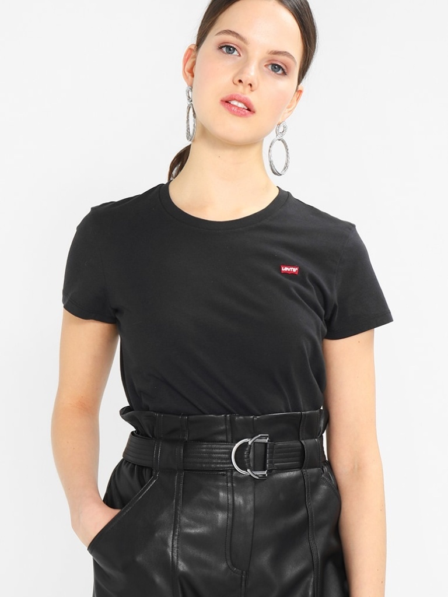
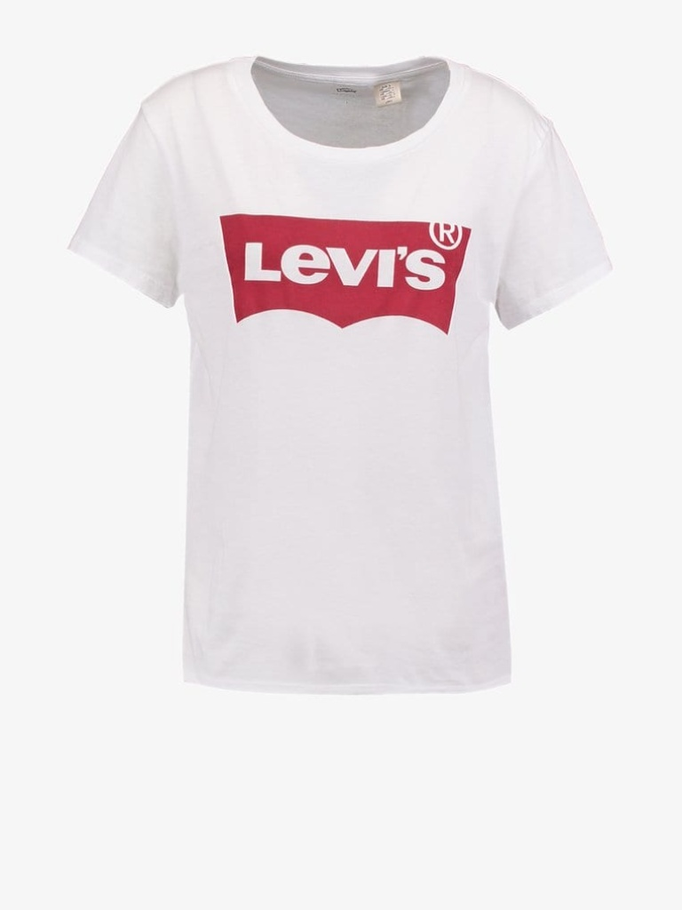
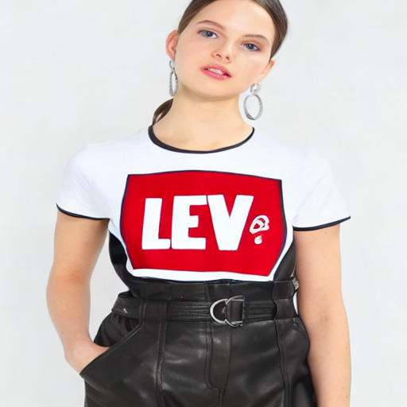
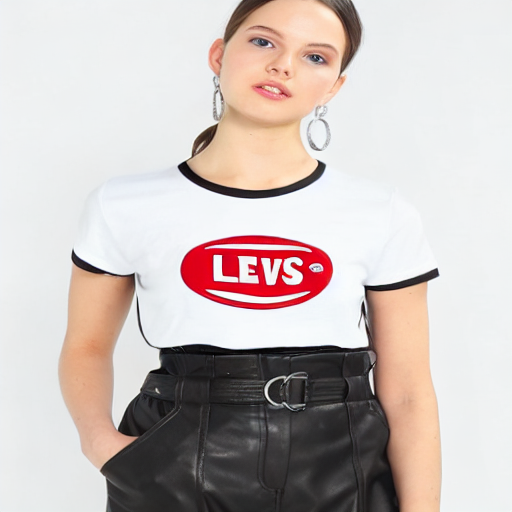
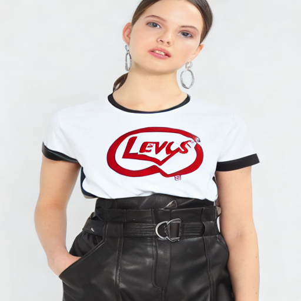

# My Virtual Try-On Project

Hi! This is a personal project I built to learn about Generative AI, specifically Stable Diffusion and how to use IP-Adapter for virtual fashion try-on. I am currently a student looking for an internship, and I made this project to understand how diffusion models work in practice.

## What it does
You give it a picture of a person and a picture of a shirt, and it will use AI to generate an image of the person wearing that exact shirt.

### Examples

<p align="center">
  
  
</p>

**Results:**
<p align="center">
  
  
  
</p>

**My latest results:**
- **Garment Alignment Score**: `0.7405` (Pretty good! The shirt looks similar)
- **Text Alignment Score**: `0.2895`

## What I learned and what needs to be fixed
- **Pros:** It's quite fast and runs okay on my laptop's GPU (8GB VRAM). The code is easy to understand.
- **Cons:** The logo sometimes gets blurry. For example, "Levi's" becomes hard to read. This is a limit of IP-Adapter because it turns the image into a vector. The shape of the shirt also sometimes doesn't match the body perfectly.
- **Next steps:** In the future, I want to try better architectures like CatVTON and learn how to use ControlNet to fix the shape issue. Currently, I evaluate the model using **CLIP Score** for Garment and Text Alignment. In the future, to comprehensively evaluate the model, I plan to compute **FID** for image realism and **LPIPS / SSIM** on a standard paired dataset like VITON-HD to measure structural preservation.


## How to run my code

### 1. Setup environment
First, you need to create a virtual environment to keep things clean.
```bash
# create venv
python -m venv venv

# activate it (Windows)
venv\Scripts\activate

# activate it (Mac/Linux)
# source venv/bin/activate
```

### 2. Install packages
```bash
pip install -r requirements.txt
```

### 3. Download the model
I already uploaded my trained weights to Google Drive. You need to download it before running.
- **Link**: [Download Checkpoint Here](https://drive.google.com/drive/folders/1ZjUIOoFwzgNSsh2G_737kzZwAs1md3_8?usp=sharing)
- Just download and put it in the `diffusion_lora_epoch_19/` folder.

*(Note: If you want to train it yourself, you can download the VITON dataset from GitHub. You don't need to do this if you just want to test my model).*

### 4. Test it!

**Way 1: Run with Web UI (Recommended)**
I made a simple web page so it's easier to test.
```bash
uvicorn api.main:app --host 0.0.0.0 --port 8000
```
Then open `http://localhost:8000` in your browser.

**Way 2: Run in terminal**
```bash
python inference.py --person images/person.jpg --garment images/cloth.jpg --prompt "A white t-shirt with red Levi's logo"
```

## Evaluation

To see how well my model is doing, I wrote a simple Python script (`evaluate.py`) to evaluate the results. Since I don't always have ground truth images to compare with, I used the CLIP model (`openai/clip-vit-base-patch32`) to measure two things:

1. **Garment Alignment Score**: How well the generated image keeps the visual features of the original shirt.
2. **Text Alignment Score**: How well the generated image matches the text prompt I give it.

**How to run the evaluation:**
```bash
python evaluate.py --garment images/cloth.jpg --output outputs/output_tryon_demo.png
```

