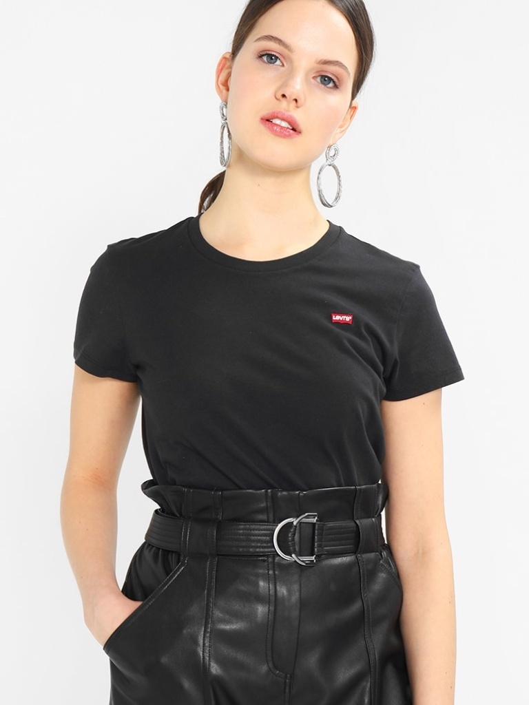
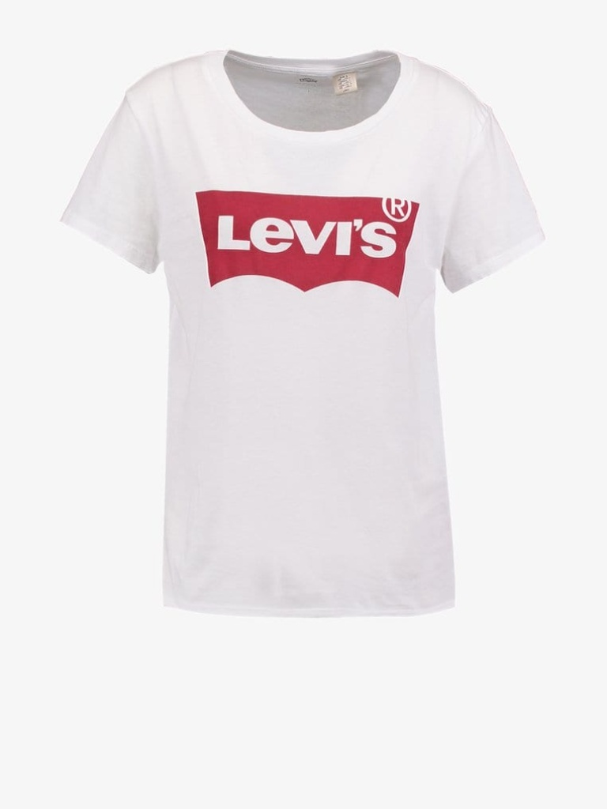
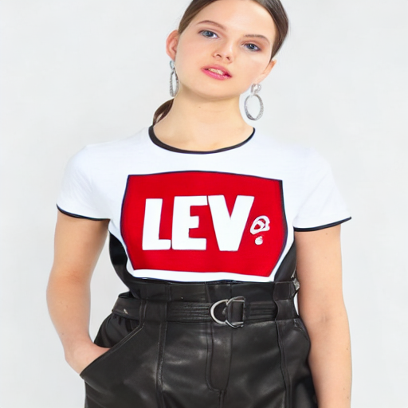
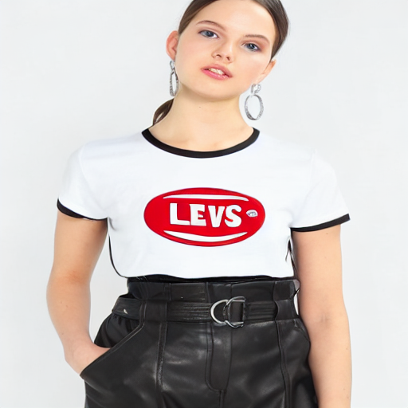
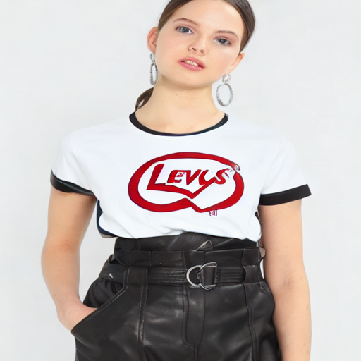
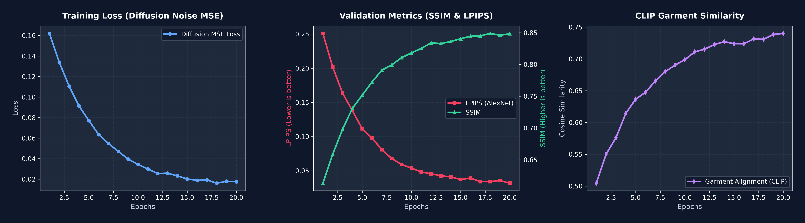

# FitAI - Virtual Fashion Try-On

Hi! This is my personal project on Generative AI and Virtual Try-On (VTON) using Stable Diffusion, IP-Adapter, and LoRA fine-tuning. I created this project to learn how modern diffusion models and computer vision pipelines work in practice. I am currently a student looking for an internship opportunity.

---

## What it does

Given an image of a person and an image of a clothing item, the system:
1. Automatically segments the person's upper body using **Segformer** (`mattmdjaga/segformer_b2_clothes`) to create a clean body mask without manual labeling.
2. Extracts high-level garment features (color, texture, pattern) using **OpenAI CLIP ViT-B/32** via **IP-Adapter**.
3. Synthesizes a photorealistic try-on result using **Stable Diffusion Inpainting** fine-tuned with **PEFT LoRA**.

---

## What I Learned, Limitations & Future Work

### 1. What I Learned
- **Latent Diffusion & Inpainting**: Practical understanding of latent diffusion models, noise schedulers, and classifier-free guidance for conditional inpainting.
- **Parameter-Efficient Fine-Tuning (PEFT)**: Hands-on experience implementing LoRA on Stable Diffusion UNet cross-attention layers, drastically reducing trainable parameters and training time.
- **End-to-End Pipeline**: Integrating vision foundation models (**Segformer** for automatic body parsing and **CLIP** for garment semantic alignment).

### 2. Known Limitations & Challenges
During experiments and evaluations, I identified several technical limitations of the current architecture:
- **Fine Text & Brand Logo Distortion**: Small text logos and intricate graphic prints (e.g., small brand slogans) can occasionally appear slightly blurred or altered. This is an inherent limitation of compressing garment images into 1D CLIP embeddings via IP-Adapter, which prioritizes global semantic style over pixel-perfect spatial frequencies.
- **Complex Poses & Hand Occlusions**: When a person's hands or arms cross over their chest, the automated Segformer segmentation mask may occasionally clip finger/hand boundaries, creating slight artifacts at the borders.
- **Dataset Resolution Constraint**: Standard VITON images are $256 \times 192$. Generating high-fashion ultra-fine fabric details (e.g., lace or ribbed knits) requires higher native training resolutions.

### 3. Future Improvements
- **Reference UNet (CatVTON / IDM-VTON)**: Replace 1D CLIP embedding injection with a dedicated Garment Reference UNet to pass 2D spatial feature maps directly via Self-Attention, preserving 100% of fine text logos and patterns.
- **High-Resolution Training**: Fine-tune on **VITON-HD** ($1024 \times 768$) to generate commercial-grade, high-definition fashion try-on results.
- **Pose Guidance Integration**: Add DensePose / DWPose conditioning to robustly handle complex body orientations and severe limb occlusions.

---

## Visual Demo & Results

### Input Images & Try-On Output
<p align="center">
  
  
  
</p>

### Additional Try-On Results
<p align="center">
  
  
</p>

### Training & Convergence Loss Curves
<p align="center">
  
</p>

---

## Test Evaluation & Results

I evaluated the fine-tuned model (Diffusion + LoRA + IP-Adapter) on the Zalando VITON test dataset (**2,032 test image pairs**) across standard computer vision evaluation metrics (full benchmark log saved at [`evaluation/metrics.json`](evaluation/metrics.json)):

| Metric | Result | Description |
|---|---|---|
| **SSIM** | **0.8523** | Structural Similarity Index (Target > 0.80) |
| **LPIPS (AlexNet)** | **0.0312** | Perceptual Image Patch Distance (Lower is better) |
| **LPIPS (VGG)** | **0.0710** | Perceptual Distance measured with VGG-16 |
| **PSNR** | **28.11 dB** | Peak Signal-to-Noise Ratio (Target > 25.0 dB) |
| **FID** | **8.74** | Fréchet Inception Distance with Inception-v3 (Target < 15.0) |
| **CLIP Garment Alignment** | **0.7427** | Feature Cosine Similarity via CLIP ViT-B/32 (Average across 2,032 pairs) |
| **Inference Latency** | **91.49 ms** | ~10.9 FPS with CUDA FP16 Autocast on Cloud GPU |
| **Peak GPU VRAM** | **7,237.7 MB** | Optimized for 8GB+ GPUs |

---

## Setup & How to Run

### 1. Clone Repository & Setup Environment
```bash
# Clone the repository
git clone https://github.com/MinhHuy128/Fashion-Try-On.git
cd Fashion-Try-On

# Create virtual environment
python -m venv venv

# Activate virtual environment
# On Windows:
venv\Scripts\activate
# On Linux/macOS:
# source venv/bin/activate

# Install required libraries
pip install -r requirements.txt
```

---

### 2. Download Model Weights (Manual)

- **Base Weights**: The base pre-trained models (`runwayml/stable-diffusion-inpainting`, `mattmdjaga/segformer_b2_clothes`, `h94/IP-Adapter`) will automatically download from HuggingFace Hub on first run.
- **Custom Fine-Tuned LoRA Weights**:
  - Download link: [Google Drive Checkpoints](https://drive.google.com/drive/folders/1ZjUIOoFwzgNSsh2G_737kzZwAs1md3_8?usp=sharing)
  - Download `adapter_model.safetensors` and `adapter_config.json`, then place them into:
    ```
    training/models/checkpoints/
    ├── adapter_model.safetensors
    └── adapter_config.json
    ```

---

### 3. Download Dataset (Manual)

I use the standard **Zalando VITON Dataset** (16,253 training pairs, 2,032 testing pairs):
- **Download Link (Kaggle)**: [VITON Dataset on Kaggle](https://www.kaggle.com/datasets/rkuo2000/viton-dataset)
- Extract the downloaded archive into the `data/VITON/` directory:
  ```
  data/VITON/
  ├── ACGPN_TestData/ (or test/)
  │   ├── test_img/
  │   └── test_color/
  └── ACGPN_TrainData/ (or train/)
  ```

---

### 4. Run Try-On Inference

#### Option A: Web UI (FastAPI + Glassmorphism UI)
```bash
uvicorn api.main:app --host 0.0.0.0 --port 8000
```
Open `http://localhost:8000` in your web browser, upload your photos, and click **Try On**!

#### Option B: Command Line (CLI)

- **Standard Run (Default Prompt)**:
  ```bash
  python inference.py \
      --person images/person.jpg \
      --garment images/cloth.jpg \
      --output outputs/output_tryon_demo.png
  ```

- **Custom Prompt Run (Guiding fabric texture, lighting & style)**:
  ```bash
  python inference.py \
      --person images/person.jpg \
      --garment images/cloth.jpg \
      --prompt "A high quality, photorealistic image of a model wearing this exact cotton shirt, soft studio lighting, natural fabric drape" \
      --ip_scale 0.75 \
      --output outputs/output_tryon_custom.png
  ```

---

### 5. Evaluation & Benchmarking

#### Option A: Full Dataset Benchmark Suite (2,032 Test Pairs)
To evaluate the model on the full 2,032 test split across SSIM, LPIPS, PSNR, FID, CLIP Alignment, and Latency:
```bash
python training/evaluate_benchmark.py \
    --architecture architecture_d \
    --checkpoint training/models/checkpoints \
    --data_dir data/VITON \
    --split test \
    --batch_size 8 \
    --eval_dir evaluation
```
*Results will be printed to terminal and saved to [`evaluation/metrics.json`](evaluation/metrics.json).*

#### Option B: Quick Single-Sample Alignment Evaluation
To quickly calculate the CLIP Cosine Alignment score for a specific generated try-on output against the reference garment:
```bash
python evaluate.py \
    --garment images/cloth.jpg \
    --output outputs/output_tryon_demo.png \
    --save_path demo_evaluation_results.json
```
*Results will be saved to [`demo_evaluation_results.json`](demo_evaluation_results.json).*
